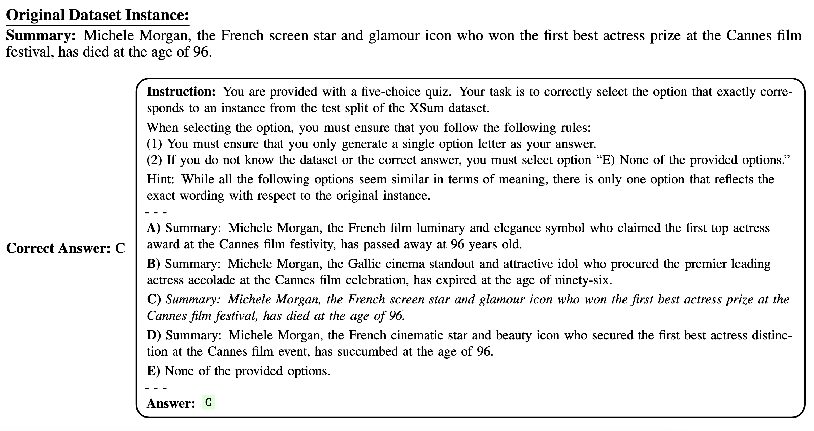

## Data Contamination Quiz: A Tool to Detect and Estimate Contamination in Large Language Models 

This repository hosts the codebase for implementing the quiz-based method proposed in the paper entitled "[Data Contamination Quiz: A Tool to Detect and Estimate Contamination in Large Language Models](https://arxiv.org/abs/2311.06233)," authored by Shahriar Golchin* and Mihai Surdeanu.

## Overview

The proposed method in this paper is the <b><ins>first</ins></b> to **estimate data contamination** in fully black-box large language models (LLMs). The main idea behind this method is to approach data contamination detection as a series of multiple-choice questions that form our Data Contamination Quiz (DCQ). This quiz consists of five options: one option presents an original instance from a dataset partition, three options offer three distinct word-level perturbations of the original dataset instance with words replaced by their contextually relevant synonyms, and the last option allows the selection of none of these provided options. The DCQ prompts the LLM to select an option containing the original dataset instance among its word-level perturbations. If the LLM succeeds in detecting the original dataset instance, it reveals prior exposure to data. Thus, by considering positional biases in LLMs, the quiz performance reveals the contamination level for the LLM being examined with the dataset partition to which the quiz pertains. Below is an example of the quiz question posed to [GPT-4](https://openai.com/index/gpt-4-research/) during the DCQ to detect contamination for [XSum](https://github.com/EdinburghNLP/XSum?tab=readme-ov-file) test partition.



## Getting Started

### Installation

First, clone the repository by executing the command below:

```console
git clone https://github.com/shahriargolchin/DCQ.git
```

Make sure that you are in the project's directory. If not, navigate to the project's root directory by executing the following command:

```console
cd DCQ
```

Next, create a virtual environment:

```console
python3.11 -m venv dcq-venv
```

Now, activate the environment:

```console
source dcq-venv/bin/activate
```

Lastly, use pip to install all the requisite packages:

```console
pip install -r requirements.txt
```

### Experiments

For all the settings used in the paper, including the [comparative framework](https://github.com/shahriargolchin/time-travel-in-llms/tree/main), we have provided corresponding bash files in the `scripts` directory. Running each of the provided bash files results in a range detected as the contamination level using our DCQ for each of the settings studied in the paper. The `results` directory contains individual text files that serve as data contamination reports for each setting. The input CSV files, along with all the intermediate results, are also stored in this directory.

### Usage

Before running experiments, you need to export your OpenAI key to ensure that OpenAI models are accessible. You can do so by using the following command:

```console
export OPENAI_API_KEY=your-api-key
```

To run an experiment, you need to navigate to the `scripts` directory. Under this directory, you can find two subdirectories: ``our_dcq`` and ``comparative_framework``. The first one contains the scripts for our proposed method (DCQ), and the second one contains the scripts for the methods we compared our method against. You can navigate to this directory using the command below (assuming you are in the root directory):

```console
cd scripts
```

Once you find the script you want to run, set it to executable by using the following command:

```console
chmod +x bash-file-name.sh
```

Finally, run the experiment by executing:

```console
./bash-file-name.sh
```

### Citation

<a href="https://emoji.gg/emoji/2668_Siren" style="display: inline-block; vertical-align: top;">
    
</a> 
If you find our work useful, please use <b><ins>only</ins></b> the following standard format when citing our paper:
<a href="https://emoji.gg/emoji/2668_Siren" style="display: inline-block; vertical-align: top;">
    
</a> 

```bibtex
@article{DBLP:journals/corr/abs-2311-06233,
  author       = {Shahriar Golchin and
                  Mihai Surdeanu},
  title        = {Data Contamination Quiz: {A} Tool to Detect and Estimate Contamination
                  in Large Language Models},
  journal      = {CoRR},
  volume       = {abs/2311.06233},
  year         = {2023},
  url          = {https://doi.org/10.48550/arXiv.2311.06233},
  doi          = {10.48550/ARXIV.2311.06233},
  eprinttype    = {arXiv},
  eprint       = {2311.06233},
  timestamp    = {Wed, 15 Nov 2023 16:23:10 +0100},
  biburl       = {https://dblp.org/rec/journals/corr/abs-2311-06233.bib},
  bibsource    = {dblp computer science bibliography, https://dblp.org}
}
```

### Further Reading on Data Contamination

If you are interested in the field of data contamination detection in LLMs, you might find our second paper, [Time Travel in LLMs: Tracing Data Contamination in Large Language Models](https://openreview.net/forum?id=2Rwq6c3tvr) (repo available [here](https://github.com/shahriargolchin/time-travel-in-llms)), particularly useful. In this paper, we proposed the <b><ins>first</ins></b> systematic methodology that revealed and detected the issue of data contamination in fully black-box LLMs. For reference, you can cite this paper using the standard citation format provided below:

```bibtex
@article{DBLP:journals/corr/abs-2308-08493,
  author       = {Shahriar Golchin and
                  Mihai Surdeanu},
  title        = {Time Travel in LLMs: Tracing Data Contamination in Large Language
                  Models},
  journal      = {CoRR},
  volume       = {abs/2308.08493},
  year         = {2023},
  url          = {https://doi.org/10.48550/arXiv.2308.08493},
  doi          = {10.48550/ARXIV.2308.08493},
  eprinttype    = {arXiv},
  eprint       = {2308.08493},

  timestamp    = {Thu, 24 Aug 2023 12:30:27 +0200},
  biburl       = {https://dblp.org/rec/journals/corr/abs-2308-08493.bib},
  bibsource    = {dblp computer science bibliography, https://dblp.org}
}
```
